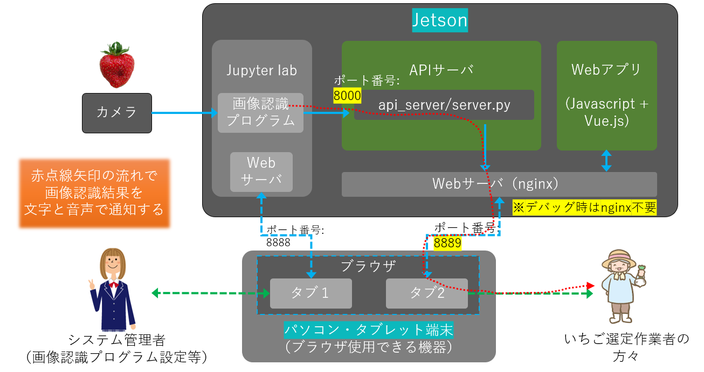
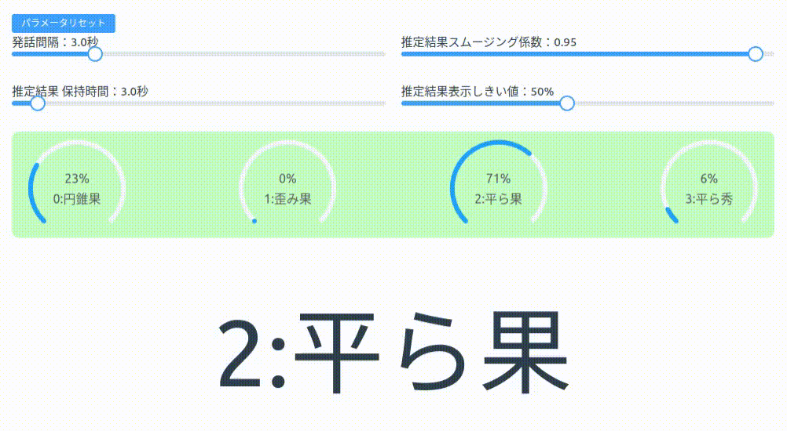

# ichigo_web

イチゴ推定結果発報用Webアプリ（Vue3）

---
## システム概要
 

---
 


---
## 推定結果処理方法

<span style="background:black; color:white; border-radius: 3px; padding: 5px;">STEP1:</span>　各クラス別に平滑移動平均を逐次計算する。
   ※到来した結果に該当するクラスの場合1、そうではない場合0を積算する。

$$ 
MMA_{class\_id, current} = ((N-1) * MMA_{class\_id, before} + InputValue) / N
$$

$$
InputValue = \begin{cases}
    1 & (correct) \\
    0 & (incorrect)
  \end{cases}
$$

   ※推定結果スムージング係数 = $(N-1)/N$


<span style="background:black; color:white; border-radius: 3px; padding: 5px;">STEP2:</span>　最も移動平均値が高いクラスを抽出し、かつ、画面上で設定される「推定結果表示しきい値」を超えた場合、最終的な推定結果として提示する。


---
## APIサーバ起動

Python仮想環境を構築し、必要なパッケージをインストールする。
```sh
cd api_server
python -m venv env
source ./env/bin/activate
pip3 install fastapi python-socketio uvicorn[standard]
```

APIサーバを立ち上げる。
```
python3 server.py
```

---
## Webアプリ

### node.jsセットアップ（※Linuxの場合）
以下nvmを用いた場合の方法を記載する。
```sh
wget -qO- https://raw.githubusercontent.com/nvm-sh/nvm/v0.39.3/install.sh | bash

nvm install stable --latest-npm
```
※nvm詳細については、以下githubリポジトリを参照のこと。
[https://github.com/nvm-sh/nvm](https://github.com/nvm-sh/nvm{:target="_blank"})


### Webアプリ実行

以下コマンドを打つことで、簡易的なウェブサーバが起動する。
```sh
cd ichigo_web
npm install
npm run dev
```
ブラウザを開き、以下URLを打ち込む。
[http://localhost:8889](http://localhost:8889{:target="_blank"})

---

### 動作テスト（API使用方法）
画像認識プログラム内から、以下APIを呼び出す。
※class_idには0〜3までの推定結果を設定する。
```sh
http://localhost:8000/v1/speech/play?class_id=0
```

以下pythonスクリプトを実行することで、Webアプリの動作確認を行うことが出来る。
```
cd api_server
python3 test.py
```


---
### その他

#### APIサーバ常駐化
systemdなどを用いて、APIサーバを常駐化させる。
[参考サイト: pythonスクリプトをdaemonにする[systemd編]](https://qiita.com/katsuNakajima/items/7ece6c74f992f652d732{:target="_blank"})


#### Webアプリ常駐化
Webサーバ(nginx)を用いて、Webアプリをサービス化する手順を示す。

<span style="background:black; color:white; border-radius: 3px; padding: 5px;">STEP1:</span> nginxをインストールする
```sh
sudo apt-get install nginx
```

/etc/nginx/nginx.confを以下のように編集しておく。
```nginx
http {
    server {
        listen       8889;
        server_name  localhost;

        root /var/www/dist_ichigo_web;

        location /ichigo_websocket {
            proxy_pass http://127.0.0.1:8000/ichigo_websocket;
            proxy_set_header X-Forwarded-For $proxy_add_x_forwarded_for;
            proxy_set_header Host $host;
            proxy_http_version 1.1;
            proxy_set_header Upgrade $http_upgrade;
            proxy_set_header Connection "upgrade";
        }
    }
}
```


<span style="background:black; color:white; border-radius: 3px; padding: 5px;">STEP2:</span> Webアプリをビルドして配置する。

```sh
npm run build
sudo cp -r dist_ichigo_web /var/www/
```

最後にブラウザで以下URLを入力すると、ウェブアプリが表示される。
[http://localhost:8889](http://localhost:8889/{:target="_blank"})
